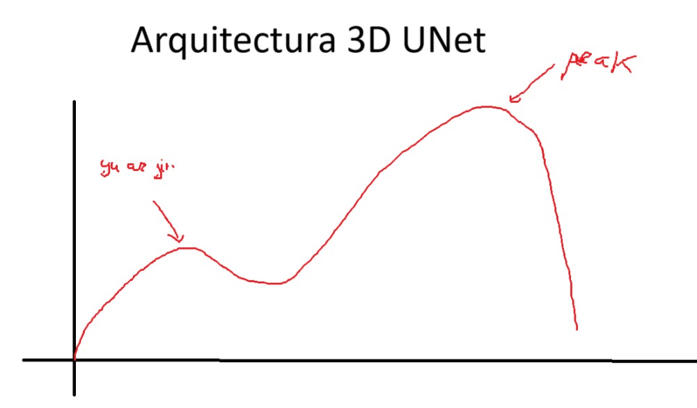

# 3D_Unet_from_scratch
3D U‑Net implementation in PyTorch from scratch using PyTorch to train a neural network for MRI images


# 🧠 3D U‑Net — Volumetric Segmentation from Scratch
This repository contains a from‑scratch implementation of the 3D U‑Net architecture, a convolutional neural network designed for volumetric (3D) segmentation. It is widely used in medical imaging tasks such as MRI and CT scan analysis, where understanding spatial relationships across all three dimensions is essential.
The project includes the full model architecture, training pipeline, configuration system, and example trained weights.

# 📁 Project Structure
```
3D_Unet_from_scratch/
│
├── carvana_dataset.py              # Example dataset class (customizable)
├── config.py                       # Hyperparameter and path configuration
├── entrenamiento_stats.png         # Training curves (loss/metrics)
├── unet2D_parts.py                 # 2D U-Net components (if needed)
├── unet3D_parts.py                 # 3D U-Net building blocks
├── unet_3D_main.py                 # Main training script
└── README.md                       # This file
```

# 🧬 3D U‑Net Architecture
The 3D U‑Net extends the original 2D U‑Net to three dimensions, enabling the model to learn volumetric features across depth, height, and width.
The architecture follows a U‑shaped encoder–decoder structure:

## 🔽 Encoder (Contracting Path)
The encoder extracts increasingly abstract features while reducing spatial resolution.
- Repeated blocks of
Conv3D → BatchNorm3D → ReLU → Conv3D → BatchNorm3D → ReLU
- Downsampling via MaxPool3D
- Channel depth increases at each level
This pathway captures global context across the volume.

## 🔼 Decoder (Expanding Path)
The decoder reconstructs spatial resolution and produces voxel‑wise predictions.
- ConvTranspose3D / UpConv3D for upsampling
- Concatenation with encoder features via skip connections
- Convolutional blocks similar to the encoder
This pathway restores fine‑grained spatial details.

## 🔗 Skip Connections
Skip connections link encoder and decoder layers at the same resolution.
They help the model:
- Recover spatial detail lost during pooling
- Improve boundary accuracy
- Maintain stable gradient flow

## 🎯 Output Layer
- Final 1×1×1 Conv3D reduces channels to the number of classes
- Activation:
- Sigmoid for binary segmentation
- Softmax for multi‑class segmentation

## 🧱 Architecture Diagram (Simplified)


# 🚀 Usage
This code use the library argparse to use arguments. You can execute the following command to see some of the arguments that uses:
```
python unet_3D_main.py --help
```

## Train
Execute:
```
python unet_3D_main.py train -e [NUM_EPOCH]
```
where NUM_EPOCH is the number of iterations to train the model

## Predict
Execute
```
python unet_3D_main.py train
```
The route of the pth model is hardcoded. In a future you could write it as an argument

Hyperparameters and dataset paths can be configured in:
config.py

# 📊 Training Results
The file entrenamiento_stats.png contains training curves such as:
- Training loss
- Validation loss
- Dice coefficient
- IoU (if implemented)
If you want, I can help you generate a more complete results section with example predictions.

# 🧪 Dataset
This project supports volumetric data formats such as:
- .nii / .nii.gz (NIfTI)
- .mha / .mhd
- .npy
- .pt
You can adapt your dataset by modifying:
carvana_dataset.py


If you want a ready‑to‑use dataset class for MRI/CT, I can generate one.

# 🧠 Key Components
✔️ unet3D_parts.py
Contains the core building blocks:
- DoubleConv3D
- Down3D
- Up3D
- OutConv3D
✔️ unet_3D_main.py
Handles:
- Dataset loading
- Training loop
- Validation
- Model saving

# 📐 Metrics
Common metrics for volumetric segmentation include:
- Dice Coefficient
- Intersection over Union (IoU)
- Binary Cross‑Entropy
- Dice Loss
I can help you add more metrics or improve the existing ones.

# 📚 References
- Çiçek et al. (2016) — 3D U‑Net: Learning Dense Volumetric Segmentation from Sparse Annotation
- Ronneberger et al. (2015) — U‑Net: Convolutional Networks for Biomedical Image Segmentation


